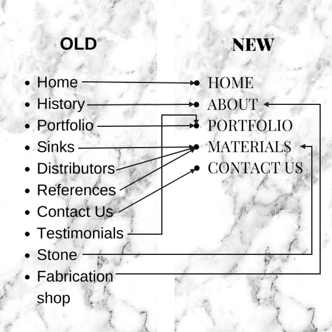

JULY 2nd
* created 2 Logos with canva to use for the website
* created Laravel project to build the product
* created views and routes for the new site layout
Old layout: HOME, HISTORY, PORTFOLIO, SINKS, DISTRIBUTORS, REFERENCES, CONTACT US, TESTIMONIALS, STONE, FABRICATION SHOP
New layout: HOME, ABOUT, PORTFOLIO, MATERIALS, CONTACT US

JULY 3rd
* made wireframes much more detialed
* made the google docs capture of the website much more detailed
* made some color palletes for the site
* added lots of inspiration pictures to the resources/assets/ pictures folder
* changed the app.layout to be styled in the way that I want my overall website to look

JULY 4th
* out for Holiday

JULY 5th
* colors design class: 10am to ~11:30am
* tweaked logo to make font bigger, cut out white margin
* future logo work based on feedback from Jaqualin (move middle text in logo to be 2 lines, de-emphaize bottom text)
* app.blade.php layout: Navbar HREFs work, clicking navbar will now change to respective view pages
* Jobs searching class: 1pm to ~2:15pm 
* app.blade.php lauoy: Navbar links now have responsive "ACTIVE" classes, to show what link is active in response to visiting that specific link page. This took much, much longer than I expected.